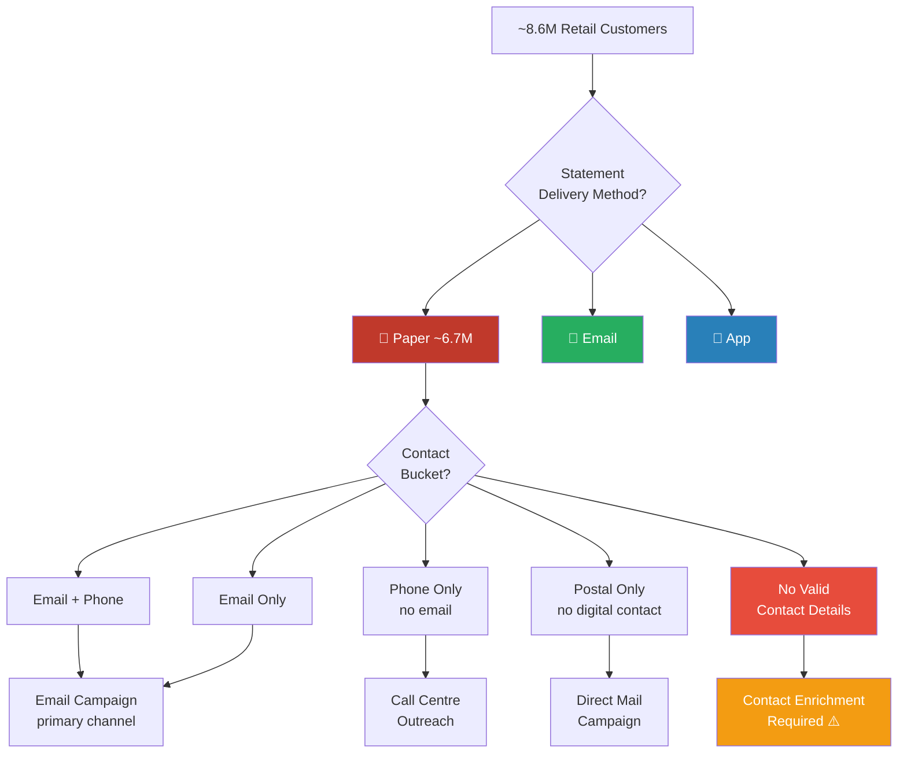

> **A note on this post:** Client details have been anonymised in line with engagement confidentiality. All figures reflect publicly available information about the institution or are approximate based on project scope.

---

| ~8.6M customers in scope | ~6.7M on paper statements | 45% with no valid contact record |
|:---:|:---:|:---:|

At the start of 2018, one of South Africa's largest retail banks was sitting on a costly problem: the majority of its ~8.6 million retail customers were still receiving monthly paper statements. The bank was preparing for a major brand transformation and had a strategic imperative to accelerate digital adoption — but before anyone could build a migration plan, someone had to answer a deceptively simple question: *who is actually receiving what, and how do we reach them?*

That question turned out to be far harder than it looked. This is the story of how I built the analytical foundation that answered it.

---

## The Problem

Paper statements are expensive. At scale, the print, postage, and handling costs across millions of accounts represent a meaningful operational line item — and that's before accounting for returned mail, incorrect addresses, and the customer service overhead of chasing delivery failures.

The bank had three statement delivery methods in use across its retail customer base:

- **Paper** — physical statements mailed to a postal or home address
- **Email** — digital statements delivered directly to a customer's inbox
- **App** — customers downloading statements on demand via the mobile or internet banking platform

The goal was clear: migrate as many customers off paper as possible. The problem was that nobody knew exactly how many customers were in each bucket, and the contact data needed to reach them was scattered across systems throughout the organisation with no single source of truth.

My role was to find out — and build the data layer that would drive the entire migration strategy.

---

## Context

**Institution:** Major South African retail bank `[anonymised]`
**Year:** 2018
**Customer base in scope:** ~8.6 million retail customers
**My role:** Business Analyst — central data function for the project
**Tools:** R, RStudio (custom scripting), Excel (initial), internal CRM and transaction data systems

---

## The Segmentation Challenge

The first task was to profile the entire retail customer base and classify every customer into one of the three statement delivery buckets. This sounds straightforward. It wasn't.

Customer data at the bank was fragmented across multiple internal systems — CRM platforms, transaction engines, lending systems, and others — with no consolidated view of how a given customer was receiving their statements. The same customer could appear differently across systems, with different contact details recorded in each, and no clear indication of which record was current.

Before I could segment customers by delivery method, I had to reconcile this fragmentation into a coherent analytical base.

```r
# Step 1: Consolidate contact data across source systems
# Coalesce resolves conflicts by prioritising the most complete/recent source

customers_master <- customers_crm %>%
  full_join(customers_lending, by = "customer_id") %>%
  full_join(customers_transactions, by = "customer_id") %>%
  mutate(
    email_address  = coalesce(email_crm, email_lending, email_transactions),
    postal_address = coalesce(address_crm, address_lending, address_transactions),
    phone_number   = coalesce(phone_crm, phone_lending, phone_transactions)
  )

# Step 2: Format validation via regex
# A contact field being populated is not enough — it must be structurally valid.
# Typos like "@ggmail" or phone numbers with the wrong digit count would cause
# silent failures downstream: assigned to a bucket, never successfully reached.

customers_validated <- customers_master %>%
  mutate(
    email_valid = !is.na(email_address) &
                  grepl("^[a-zA-Z0-9._%+\\-]+@[a-zA-Z0-9.\\-]+\\.[a-zA-Z]{2,}$",
                        email_address, perl = TRUE),

    # South African numbers: 10 digits local (0XXXXXXXXX) or 11 with country code
    phone_valid = !is.na(phone_number) &
                  grepl("^(0[0-9]{9}|27[0-9]{9})$",
                        gsub("[\\s\\-()]", "", phone_number), perl = TRUE),

    postal_valid = !is.na(postal_address) & nchar(trimws(postal_address)) > 0,

    # Flag structurally invalid records for internal remediation
    email_invalid_format = !is.na(email_address) & !email_valid,
    phone_invalid_format = !is.na(phone_number)  & !phone_valid
  )

# Step 3: Assign mutually exclusive contact buckets — using validated flags only
# Order matters: combinations before single-channel segments to prevent bleed

customers_segmented <- customers_validated %>%
  mutate(
    contact_bucket = case_when(
      email_valid & phone_valid               ~ "Email + Phone",
      email_valid & !phone_valid              ~ "Email Only",
      !email_valid & phone_valid              ~ "Phone Only",
      !email_valid & !phone_valid & postal_valid ~ "Postal Only",
      TRUE                                    ~ "No Valid Contact"
    )
  )

# Step 4: Report — segment counts and format failure rates
customers_segmented %>%
  count(contact_bucket) %>%
  mutate(pct = round(n / sum(n) * 100, 1))

# Surface invalid-format records for internal remediation
customers_segmented %>%
  filter(email_invalid_format | phone_invalid_format) %>%
  select(customer_id, email_address, phone_number,
         email_invalid_format, phone_invalid_format)
```

Two disciplines were at work here. First, **mutual exclusivity**: a customer with both a valid email and a valid phone had to be counted once, in the correct combined bucket. Getting this wrong would have inflated campaign volumes and misallocated call centre capacity.

Second, **format integrity**: a contact field being populated was not enough. An email address present in the system but structured as `name@ggmail.com` or a phone number with a missing digit would be assigned to a digital bucket and silently fail on send — the customer would never be reached, and the campaign metrics would misreport reachability. The regex layer ensured only structurally valid contacts were treated as usable.

Invalid-format records weren't discarded. Those caught by the initial regex pass were reviewed and corrected where possible directly within the analysis. The residual cases — records where the data was too ambiguous or malformed to resolve programmatically — were extracted and handed off to a dedicated internal AI team, flagged against the customer's account name and number, for deeper remediation. This two-stage triage approach meant that straightforward errors were resolved at source, while genuinely complex data quality issues were escalated to the right capability. It also fed directly into the contact enrichment work that followed.

Once a working base was assembled, I built custom R scripts to segment customers into their statement buckets, quantify each segment, and — critically — analyse what contact information was actually available for each group.

---

## From Segments to Strategy

The segmentation output fed directly into the digital migration strategy. The logic was straightforward once the data was clean: the communication channel used to reach a customer depended entirely on what verified contact information existed for them.



This framework meant the project team could, for the first time, put a number against each communication stream — how many emails to send, how many letters to prepare, how many call centre hours to allocate. The segmentation output wasn't just analytical output; it was the operational plan.

Of the ~8.6 million retail customers, approximately **~6.7 million** were classified as paper statement customers — representing roughly 78% of the total base. Of those, only **~22% had a valid email address on record**, meaning the majority could not be reached digitally through existing contact data alone.

---

## The Contact Data Problem

Segmenting customers by delivery method was one challenge. Understanding whether the bank could *actually reach* those customers to convert them was another.

Two persistent issues emerged from the contact data analysis:

**Incorrect or stale contact information.** A significant proportion of contact records — addresses, email addresses, phone numbers — were either outdated, entered incorrectly at point of capture, or had never been validated after initial onboarding. For a customer who had been with the bank for several years without updating their details, the record in the system could be years out of date.

**Returned and undeliverable contact.** A subset of customers had contact details on record that had already proven to be invalid — returned mail, bounced emails, disconnected numbers. These customers were effectively unreachable through standard channels.

The result was a sizeable population of customers who were on paper statements and for whom the bank had no reliable way to initiate digital conversion through existing outreach. This became the catalyst for a separate body of work: the contact enrichment project. **`[See Post 2]`**

---

## What the Analysis Produced

The output of this work was a structured data layer that gave the project three things it didn't have before:

**Segment quantification.** For the first time, the bank had a defensible, data-driven count of how many customers sat in each statement delivery bucket — broken down by product line, region, and customer tenure.

**Contact channel readiness.** For each paper statement customer, the analysis produced a contact readiness score — essentially, which channel (email, phone, post) was available, which had been validated, and which was likely to fail.

**Migration sequencing.** By combining segment size with contact readiness, the project team could sequence the conversion campaign: prioritise the highest-volume, highest-reachability segments first, and design targeted interventions for the harder-to-reach populations.

---

## Impact

- Delivered the first complete segmentation of the retail customer base by statement delivery method — across ~8.6 million accounts, with ~6.7 million classified as paper statement customers
- Identified **24%** of paper statement customers as immediately contactable via digital channels (email or phone), enabling direct and prioritised campaign targeting
- Exposed a **45%** population with no valid or reliable contact record — the root cause insight that triggered the contact enrichment project
- Analysis output directly shaped the sequencing and channel allocation of the bank-wide digital migration strategy, determining which customers to target first, via which channel, and which required enrichment before any outreach was possible

---

## Skills Showcased

`R` · `RStudio` · `Data Analysis` · `Customer Segmentation` · `Contact Data Quality` · `Retail Banking` · `Digital Transformation` · `Financial Services` · `Business Analysis` · `Data Wrangling`
