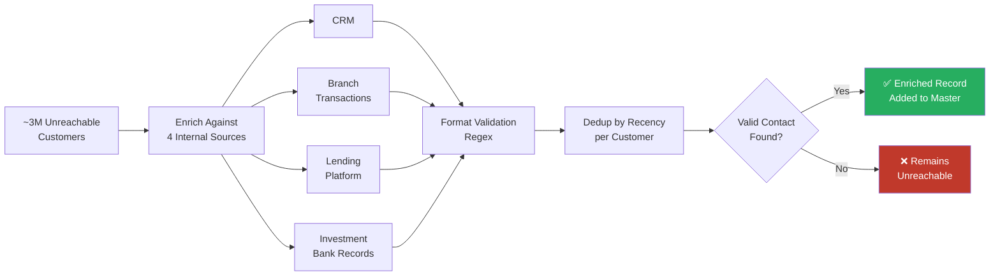

> **A note on this post:** Client details have been anonymised in line with engagement confidentiality. This project was a direct spinoff from the [paper-to-digital statement migration]({{ site.baseurl }}) engagement at the same institution.

---

| ~3M customers in scope | 4 data sources consolidated | 16 hours → 16 minutes |
|:---:|:---:|:---:|

A segmentation analysis of a major South African retail bank's customer base had surfaced a striking finding: approximately 45% of paper statement customers — roughly 3 million people — had no valid contact record anywhere in the bank's systems. No usable email address. No valid phone number. No reliable way to reach them as part of the digital migration campaign.

The conventional response would have been to accept those customers as unreachable for now and focus campaign effort on the 24% who could be contacted immediately. I took a different view. The data to find these customers almost certainly existed somewhere in the bank. It just hadn't been joined up.

This is the story of how I owned and delivered a contact enrichment project that changed that — and left a permanent capability behind when the engagement ended.

---

## The Problem

The statement migration project had cleanly segmented the customer base by contact availability. But segmentation only reveals a gap — it doesn't close it. A 45% unreachable population represented millions of customers who would remain on paper indefinitely unless something more deliberate was done.

The hypothesis was straightforward: a customer who had never provided an email address to the statements team might still have one recorded elsewhere — in a lending application, a branch transaction, an investment account opening form. The bank was large and siloed enough that these data points had simply never been consolidated.

The question was whether that hypothesis held at scale, and if so, whether the enrichment process could be made fast enough to be operationally useful.

---

## Context

**Institution:** Major South African retail bank `[anonymised]`
**Year:** 2018
**Customers in scope:** ~3 million (those with no valid email and/or phone on record)
**My role:** Project owner — defined requirements, data flows, and acceptance criteria
**Execution:** Internal data science team, briefed and directed by me
**Data sources:** CRM system, branch transaction platform, retail lending system, investment bank records

---

## My Role

This project was mine to run. I identified the problem, made the case for the enrichment approach, defined the logic for how records should be joined and prioritised across sources, and set the acceptance criteria for what constituted a valid enriched contact.

The data science team executed the build. But the requirements, the architecture of the approach, and the decisions about what to trust and what to discard were mine.

This distinction matters: contact enrichment at this scale has real downstream consequences. A wrongly attributed phone number reaches the wrong person. A mismatched email creates a compliance exposure. The logic governing source priority, match confidence, and output validation had to be deliberate — and it was.

---

## The Approach

The enrichment logic worked in layers. For each customer in the unreachable population, we searched across four internal data sources — in priority order — for any valid contact detail not already captured in the master record.

```r
# Illustrative enrichment logic — R-based initial analysis
# For each customer with no valid contact, query alternative internal sources
# and apply the same format validation used in the segmentation analysis

enrich_contacts <- function(customer_ids, sources) {

  # Pull candidate contact records from each source
  crm_contacts         <- sources$crm %>%
                          filter(customer_id %in% customer_ids) %>%
                          select(customer_id, email, phone, recorded_date) %>%
                          mutate(source = "CRM")

  branch_contacts      <- sources$branch_transactions %>%
                          filter(customer_id %in% customer_ids) %>%
                          select(customer_id, email, phone, recorded_date) %>%
                          mutate(source = "Branch")

  lending_contacts     <- sources$lending %>%
                          filter(customer_id %in% customer_ids) %>%
                          select(customer_id, email, phone, recorded_date) %>%
                          mutate(source = "Lending")

  investment_contacts  <- sources$investment_bank %>%
                          filter(customer_id %in% customer_ids) %>%
                          select(customer_id, email, phone, recorded_date) %>%
                          mutate(source = "Investment Bank")

  # Combine, validate format, and rank by recency within each customer
  all_candidates <- bind_rows(
    crm_contacts, branch_contacts, lending_contacts, investment_contacts
  ) %>%
    mutate(
      email_valid = grepl(
        "^[a-zA-Z0-9._%+\\-]+@[a-zA-Z0-9.\\-]+\\.[a-zA-Z]{2,}$",
        email, perl = TRUE
      ),
      phone_valid = grepl(
        "^(0[0-9]{9}|27[0-9]{9})$",
        gsub("[\\s\\-()]", "", phone), perl = TRUE
      )
    ) %>%
    filter(email_valid | phone_valid) %>%
    arrange(customer_id, desc(recorded_date)) %>%
    group_by(customer_id) %>%
    slice(1)  # Take the most recent valid record per customer

  return(all_candidates)
}
```

Source priority was intentional, not arbitrary. More recent contact records were preferred over older ones. Records from transactional systems — where a customer had actively provided details in a live interaction — were treated as higher confidence than those pulled from older application forms.

The same regex validation applied in the original segmentation analysis was carried through here. Any candidate record that didn't pass format checks was discarded, regardless of source. Enrichment that introduced new invalid contacts would have defeated the purpose entirely.

---

## The Runtime Problem

The initial version of the enrichment script ran in **R** across the full customer scope. Joining ~3 million customer records against four internal data sources, applying validation logic, and deduplicating to a single enriched output per customer was computationally expensive.

**Runtime: 16 hours.**

That ruled out any operational use. A 16-hour batch process can't support a live migration campaign where contact enrichment needs to be re-run as new customer interactions generate fresh data.

---

## The Optimisation

I partnered with the bank's internal data science team to refactor the process. I owned the requirements — the logic had to remain identical, the output had to match the original exactly, and the validation rules were non-negotiable. The team owned the execution: rebuilding the pipeline with performance as the primary constraint.



The result was a pipeline that produced the same output in **16 minutes** — a 60x reduction in runtime. The same logic, the same validation, the same source priority. Just fast enough to be useful.

---

## The Deployment

A one-off enrichment run would have had limited value. The real prize was making the capability persistent — so that the bank could continue enriching customer contact records as part of business-as-usual operations, not just as a project artefact.

The optimised pipeline was packaged and deployed as an **official internal web application**, accessible to bank employees. For the first time, staff could initiate a contact enrichment run against the customer base without requiring a data team to execute it manually. The project left something behind.

---

## Impact

- Scoped and delivered a contact enrichment pipeline covering ~3 million previously unreachable customers across four internal data source systems
- Reduced enrichment runtime from **16 hours to 16 minutes** — making the process operationally viable for live campaign use
- Applied consistent format validation across all enriched records, ensuring output quality matched the standards set in the original segmentation analysis
- Defined the full requirements and process architecture; directed data science team execution against a clear brief
- Delivered the capability as a permanent internal tool — deployed as an official web application used by bank employees, not a one-off project deliverable

---

## Skills Showcased

`R` · `Data Engineering` · `Contact Data Enrichment` · `Cross-system Integration` · `Requirements Definition` · `Data Science Collaboration` · `Project Ownership` · `Retail Banking` · `Financial Services` · `Regex Validation` · `Pipeline Optimisation`
